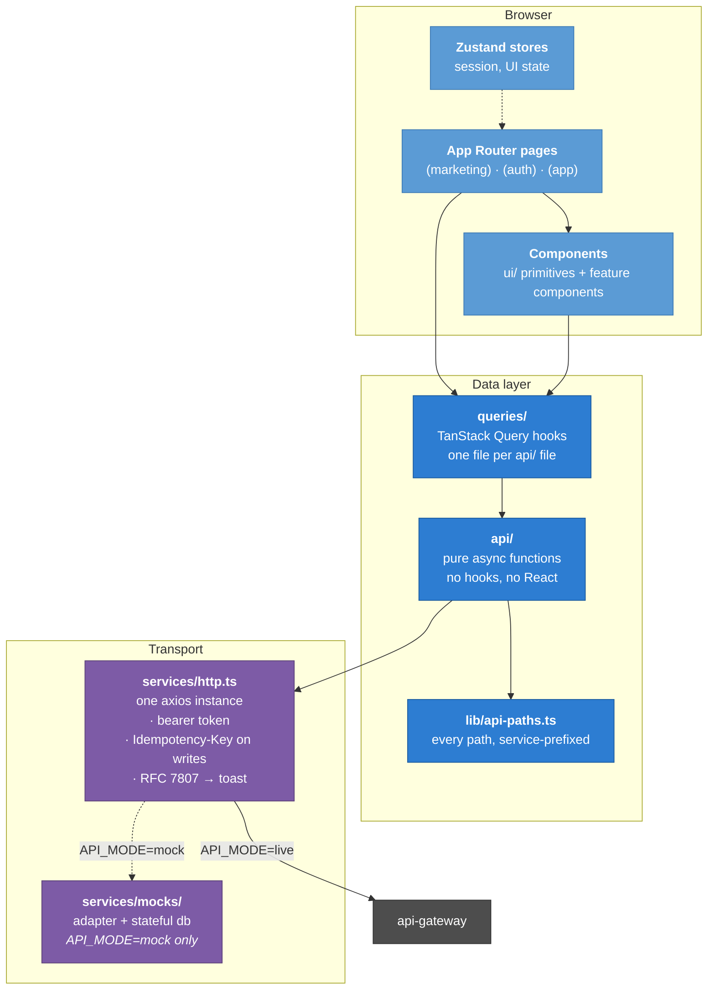
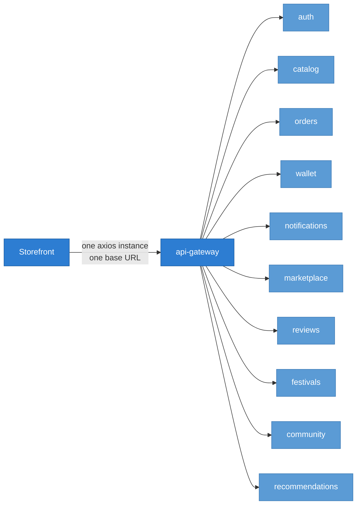

# Arcadia — Storefront

The web client for [Arcadia](https://github.com/MS-Arcadia/PHASE02), a digital game
distribution platform. Next.js 16, React 19, TypeScript, talking to twelve services through
one gateway.

Dark only, desktop-first, English only, installable as a PWA.

---

## Quick start

```bash
pnpm install
pnpm dev          # http://localhost:3000
```

Out of the box it runs against a **mock backend** — no services, no database, no broker
needed. `services/mocks/adapter.ts` is installed as a real axios adapter, so a mocked
request goes through the same interceptors, the same RFC 7807 error mapping and the same
`AxiosError` shape as a real one.

```bash
pnpm typecheck    # tsc --noEmit
pnpm lint         # eslint
pnpm format       # prettier --write
pnpm build        # production build
```

Two environment variables decide what answers:

```bash
NEXT_PUBLIC_API_MODE=mock                                   # the mock adapter
NEXT_PUBLIC_API_MODE=live                                   # the real gateway
NEXT_PUBLIC_API_URL=https://api.arcadia.aptcodegen.online
```

---

## Architecture



The layering rule is simple and enforced by convention: a component never calls `http`
directly, a `queries/` hook never builds a URL, and `lib/api-paths.ts` is the only place a
path is written down.

### Route groups

```
app/
  (marketing)/     public — no account needed
    /              landing, with real published games
    /browse        the catalogue, searchable
    /browse/[id]   one game
    /community     posts across games
    /festivals     seasonal sales
  (auth)/          signed out — sign-in, sign-up. No shell
  (app)/           signed in — AuthGuard + sidebar + top bar
    /store         the storefront
    /library       owned games
    /wallet        balance, ledger, top-up
    /orders        orders and instalment schedules
    /games/[id]    one game + the acquire panel
    /market        item trading
    /profile       profiles
    /notifications
    /developer     DEVELOPER — register, submit, price, publish
    /review        SUPPORT — the review queue
    /gift-cards    SUPPORT/ADMIN — issue and track
    /admin         ADMIN — accounts, roles, bans
  /mock-bank/[id]  the sandbox bank, mock mode only
  /offline         what the service worker serves with no network
```

Public browsing exists deliberately: the catalogue's list and detail reads are public so a
store page can be linked and indexed, and a visitor can see what is on sale before deciding
whether to sign up.

---

## Use cases by role

| Role           | Can do                                                                                                                                         |
| -------------- | ---------------------------------------------------------------------------------------------------------------------------------------------- |
| **Visitor**    | Browse the catalogue, read one game, read the community and festivals, create an account                                                       |
| **Basic user** | + buy, gift, pre-order, pay in instalments, top up, redeem gift cards, review, post, comment, react, trade items, manage a profile             |
| **Developer**  | + register a game, upload art and builds, submit for review, accept a suggested price, publish, withdraw, approve or reject festival discounts |
| **Support**    | + work the review queue, approve/reject/suggest a price, issue gift cards, moderate posts and reviews                                          |
| **Admin**      | + approve registrations, grant roles, ban and unban, create and run festivals                                                                  |

Gating is for **tidiness, not security**. Each page checks the role to decide what to show,
and every service checks the token independently — so a hand-typed URL gets an explanation
rather than a blank screen or data it should not have.

---

## Talking to the platform

Every path is written service-prefixed against one base URL in `lib/api-paths.ts` —
`/catalog/v1/games`, `/orders/v1/orders` — and those prefixes are literally the gateway's
own routing table. A path that is wrong here is wrong there too.



Ten of the gateway's twelve prefixes are called from here. The two that are not:

- **media-service** — nothing here uploads a file directly. Game art arrives already-signed
  inside a game's `media[]`.
- **payment-service** — reached by _redirect_, not by call. A top-up answers with a
  `redirect_url` and the browser follows it to the bank.

### Two rules that are load-bearing

**Wire shapes are transcribed, never invented.** Every type in `types/*.api.type.ts` was
copied from the owning service's DTO. This matters more than it sounds: several bugs on this
project were shapes that looked reasonable and did not exist — a wallet ledger read as
`items` when the service returns `entries`, a library read as `{ownership, game}` pairs when
the service returns flat records, a `COVER` media kind the catalogue has never had.

**If the mock disagrees with the service, the mock is wrong.** Each of those bugs was
invisible in development precisely because the mock agreed with the client instead of with
the service. `services/mocks/db.ts` enforces the rules the real services enforce — a
purchase debits the wallet and fails when it is short, buying twice is refused, a refund is
refused after twelve hours — and a write to `/wallet/*` or `/orders/*` without an
`Idempotency-Key` is rejected, exactly as the real services reject it.

---

## Tech stack

| Concern         | Choice                                                  |
| --------------- | ------------------------------------------------------- |
| Framework       | Next.js 16 (App Router, Turbopack, React Compiler)      |
| Language        | TypeScript 5, strict, `target: ES2020` for BigInt       |
| UI              | React 19                                                |
| Styling         | Tailwind CSS v4 + CSS variables                         |
| Primitives      | shadcn/ui `base-nova` — built on **Base UI**, not Radix |
| Server state    | TanStack Query v5                                       |
| Client state    | Zustand v5                                              |
| Forms           | React Hook Form + Zod                                   |
| HTTP            | Axios, one instance                                     |
| Icons           | lucide-react                                            |
| Animation       | motion                                                  |
| Toasts          | sonner                                                  |
| Package manager | pnpm                                                    |

Base UI rather than Radix has two consequences that bite: there is no `form.tsx` (the
equivalent is `field.tsx`), and composition uses a `render` prop rather than `asChild` — a
`<Button>` rendering a `<Link>` also needs `nativeButton={false}`.

### Money

`amount_minor` is a **string** holding an integer count of minor units, because a JavaScript
client truncates integers above 2^53 and IRR amounts get there.

- Format with `lib/money.ts` — never `Number(amount_minor) / 100`.
- Arithmetic is `BigInt`. Splitting is integer division; the remainder goes on the last part.
- Discounts are basis points: `2000` is 20%, `10000` is free.
- `effective_price` is computed server-side and never recomputed here.

---

## Deployment

Built as a standalone Next.js output and shipped as a container. CI builds with
`API_MODE=live` and the gateway's public URL, then deploys to the `arcadia` namespace.

`next/image` needs the gateway's origin in `remotePatterns` to render game art — it is
derived from `NEXT_PUBLIC_API_URL` at build time rather than hard-coded, so moving domains
does not silently break every cover.

---

## Conventions

Full rules for contributors are in [`CLAUDE.md`](CLAUDE.md) and [`AGENTS.md`](AGENTS.md).
The short version:

- Default to Server Components; `"use client"` only for hooks, handlers or browser APIs.
- Pages stay thin — `page.tsx` re-exports a `_page.tsx`.
- Every query sets an explicit `staleTime`.
- Mutations that change money, ownership or notifications invalidate all three.
- Logical properties (`ms-`/`me-`, `ps-`/`pe-`) — the UI is LTR today, and the layout was
  built so direction is one attribute.
- Interactive targets get `min-h-11`.
- Empty states say what will appear there and why; errors say what happened and what to do.
